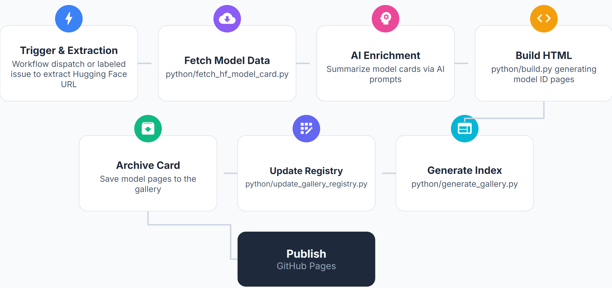
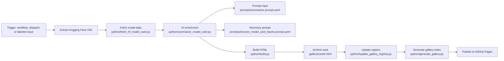

# Model Card Builder

Model Card Builder is an AI automation pipeline that converts a Hugging Face model URL into a typed model-data card, generates a branded HTML model card, updates a searchable gallery, and publishes the result to GitHub Pages.

## What It Does

- Fetches model metadata and README content from Hugging Face
- Normalizes data into a typed Model Card Data contract
- Optionally enriches missing narrative sections with GitHub Models using prompt files
- Generates Model_Card.html with named template and theme architecture
- Archives cards, updates gallery/cards.json, and rebuilds the gallery index
- Publishes static site output through GitHub Pages automation

### Stage Notes

- Trigger policy: manual workflow_dispatch always runs; issue-triggered flow runs only when the generate-model-card label is applied to an issue containing a Hugging Face URL.
- AI step: summarization and recovery are designed to be fault-tolerant in workflow execution so generation can continue if enrichment fails.
- Output artifacts: Model_Card.html, model_data.json, and build logs are uploaded as workflow artifacts; gallery content is regenerated and deployed.

## Hugging Face Integration

The builder integrates with Hugging Face at multiple layers:

- API metadata fetch from huggingface.co/api/models/{repo_id}
- README fetch from huggingface.co/{repo_id}/raw/main/README.md
- URL-to-repo parsing for inputs like https://huggingface.co/org/model
- Frontmatter and section extraction for overview, intended use, deployment, limitations, and training details
- Metric extraction using pipeline-aware regex patterns (for example mAP, precision, recall, F1, accuracy)
- Asset extraction from markdown images for representative visuals
- Completeness assessment to identify missing facets before optional recovery

This logic is implemented primarily in python/model_card_data.py and feeds downstream rendering and gallery publication steps.

## Operational Automation

## Automation and Publishing

Workflow file: .github/workflows/model-card-builder.yml

- Fetches and normalizes model data
- Runs optional AI summarization and targeted recovery using prompt contracts
- Builds HTML output
- Archives card to gallery/cards/
- Updates gallery/cards.json registry with model metadata
- Regenerates gallery/index.html
- Prepares site/ and deploys to GitHub Pages

Live gallery:

- https://MichaelAkridge-NOAA.github.io/model-card-builder/gallery/

## Architecture Notes

- Template: named arrangement of sections and blocks in the Card Document
- Theme: named visual treatment applied by the renderer

Model Card Builder uses these internal extension points while presenting a single automated pipeline at the product level.

## Local Development

For local setup and command-line usage, see [LOCAL_QUICKSTART.md](./LOCAL_QUICKSTART.md).

## References

- https://github.com/tensorflow/model-card-toolkit
- https://modelcards.withgoogle.com/

#### Disclaimer

This repository is a scientific product and is not official communication of the National Oceanic and Atmospheric Administration, or the United States Department of Commerce. All NOAA GitHub project content is provided on an as is basis and the user assumes responsibility for its use. Any claims against the Department of Commerce or Department of Commerce bureaus stemming from the use of this GitHub project will be governed by all applicable Federal law. Any reference to specific commercial products, processes, or services by service mark, trademark, manufacturer, or otherwise, does not constitute or imply their endorsement, recommendation or favoring by the Department of Commerce. The Department of Commerce seal and logo, or the seal and logo of a DOC bureau, shall not be used in any manner to imply endorsement of any commercial product or activity by DOC or the United States Government.

#### License

- Details in [LICENSE.md](./LICENSE.md).
